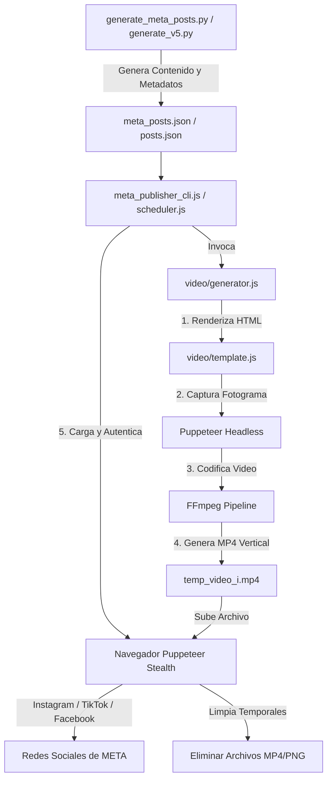

# VAREGO: Advanced Autonomous Temporal Orchestrator & Content Matrix System


---

## 📖 Resumen / Abstract

La automatización de la distribución de contenidos a gran escala en redes sociales modernas impone retos técnicos sumamente complejos. Entre estos destacan las estructuras dinámicas del Modelo de Objetos del Documento (DOM), los estrictos límites de tasa de peticiones (rate-limiting) y la necesidad imperiosa de una distribución temporal natural para evitar la detección de patrones automatizados por parte de los algoritmos anti-bot.

**VAREGO v3.0** es un sistema de orquestación autónomo e híbrido diseñado para resolver estas limitaciones. Integra un núcleo en **Node.js (Puppeteer Extra Stealth)** para la interacción web interactiva y persistencia de sesiones, un motor de procesamiento gráfico y compresión en **Python 3.11**, y una canalización de renderizado multimedia mediante **FFmpeg**. 

En esta actualización, VAREGO expande sus capacidades integrando un **Generador de Vídeos Dinámicos en Formato Vertical (9:16)** y **Publicadores Automatizados para META** (Instagram Reels, TikTok y Facebook), permitiendo una sincronización multi-plataforma robusta, tolerante a fallos y con simulación de comportamiento humano de alta fidelidad.

---

## 🏛️ 1. Arquitectura de Sistemas y Componentes

El diseño de VAREGO se fundamenta en un flujo híbrido donde el procesamiento lógico y de contenido se separa del motor de automatización del navegador.



### 1.1 Distribución de Archivos y Responsabilidades

| Directorio / Archivo | Lenguaje / Formato | Responsabilidad Técnica |
| :--- | :--- | :--- |
| `varego.js` | JavaScript (Node.js) | Núcleo de control de X (Twitter). Recibe parámetros `--meta` para enlazar flujos. |
| `meta_publisher_cli.js` | JavaScript (Node.js) | Interfaz de línea de comandos (CLI) unificada para ejecutar autenticaciones, publicaciones y generación de vídeo independiente. |
| `generate_meta_posts.py` | Python 3.11 | Motor de generación sintáctica que estructura posts adaptados al formato visual y semántico de Reels y TikTok. |
| `meta_posts.json` | JSON | Matriz de datos curados con temas, descripciones y configuraciones estéticas de publicación. |
| [video/template.js](file:///C:/Users/jegom/VAREGO/video/template.js) | JavaScript (Node.js) | Generador de plantillas HTML y CSS premium que soportan degradados dinámicos y estilos fluidos (*glassmorphism*). |
| [video/generator.js](file:///C:/Users/jegom/VAREGO/video/generator.js) | JavaScript (Node.js) | Integrador gráfico de Puppeteer y FFmpeg para capturar fotogramas y transformarlos en secuencias de vídeo animadas. |
| [meta/auth.js](file:///C:/Users/jegom/VAREGO/meta/auth.js) | JavaScript (Node.js) | Utilidad manual con interfaz por consola para guardar perfiles de Chrome autenticados y evitar bloqueos por MFA. |
| [meta/instagram.js](file:///C:/Users/jegom/VAREGO/meta/instagram.js) | JavaScript (Node.js) | Automatizador de carga de Reels e imágenes en la interfaz de usuario de Instagram. |
| [meta/tiktok.js](file:///C:/Users/jegom/VAREGO/meta/tiktok.js) | JavaScript (Node.js) | Automatizador de carga y publicación en el Creator Center de TikTok, resolviendo la evasión de *iFrames*. |
| [meta/facebook.js](file:///C:/Users/jegom/VAREGO/meta/facebook.js) | JavaScript (Node.js) | Manejador de publicaciones con archivos multimedia para perfiles y páginas de Facebook. |
| [meta/business_suite.js](file:///C:/Users/jegom/VAREGO/meta/business_suite.js) | JavaScript (Node.js) | Publicador unificado a través de Meta Business Suite para flujos multicuenta. |
| [meta/scheduler.js](file:///C:/Users/jegom/VAREGO/meta/scheduler.js) | JavaScript (Node.js) | Programador de hilos de publicación. Administra la pila, el control de reintentos y la limpieza física de memoria en disco. |
| [meta/meta_config.json](file:///C:/Users/jegom/VAREGO/meta/meta_config.json) | JSON | Configuración de variables del sistema, dimensiones de renderizado, y banderas de activación de redes sociales. |

---

## 🎨 2. Motor de Generación de Vídeo Dinámico

La generación de contenido multimedia de alta fidelidad se ejecuta sin requerir bibliotecas nativas complejas que comprometan la portabilidad del sistema. En su lugar, VAREGO aprovecha la combinación de renderizado web en Puppeteer y la potencia de procesamiento multimedia de FFmpeg.

### 2.1 Maquetación HTML con Glassmorphism y CSS Premium
El archivo [video/template.js](file:///C:/Users/jegom/VAREGO/video/template.js) genera documentos HTML5 válidos estructurados para relaciones de aspecto verticales de 9:16 ($1080 \times 1920$ píxeles). La maquetación incluye:
* **Glow Circles (Círculos de Brillo)**: Elementos flotantes absolutos con desenfoques radiales (`filter: blur(120px)`) para simular profundidad de campo.
* **Glassmorphic Card (Tarjeta de Cristal)**: Un contenedor translúcido centralizado utilizando filtros de retroceso avanzados:
  ```css
  background: rgba(255, 255, 255, 0.06);
  backdrop-filter: blur(35px);
  -webkit-backdrop-filter: blur(35px);
  border: 1px solid rgba(255, 255, 255, 0.12);
  ```
* **Cálculo de Fuente Autoadaptable**: Para mitigar el riesgo de desbordamiento de texto en composiciones largas, la tipografía recalcula sus dimensiones en función del recuento de caracteres:
  ```javascript
  let fontSize = '44px';
  if (text.length > 280) fontSize = '32px';
  else if (text.length > 180) fontSize = '38px';
  ```

### 2.2 Captura de Fotogramas mediante Puppeteer Headless
El ciclo de vida del renderizado de imágenes consta de los siguientes pasos:
1. El HTML generado es escrito temporalmente a un archivo en disco (`temp_card.html`).
2. Se levanta una instancia headless de Google Chrome forzando las dimensiones exactas de destino.
3. Se navega al recurso local asegurando la carga total de las fuentes vectoriales alojadas en Google Fonts mediante el evento `'networkidle0'`.
4. Se exporta un buffer PNG binario de alta densidad y se procede a la destrucción del entorno virtual del navegador y del archivo temporal HTML.

### 2.3 Compilación y Animación con FFmpeg (Efecto Ken Burns)
Para evitar que el vídeo generado sea un simple fotograma estático, VAREGO aplica una transformación afín dinámica utilizando el filtro `zoompan` de FFmpeg. Esto genera un efecto de zoom suave e inmersivo desde el centro de la imagen.

La ecuación de interpolación del factor de zoom $z$ en el fotograma actual $f$ se define como:
$$ z(f) = \min\left(z_0 + f \cdot \Delta z, \, z_{max}\right) $$

Donde:
* $z_0 = 1.0$ (Zoom inicial).
* $\Delta z = 0.0008$ (Paso de zoom por fotograma).
* $z_{max} = 1.08$ (Zoom máximo para evitar pixelación).

La expresión de llamada en el pipeline de FFmpeg se ejecuta como:
```bash
ffmpeg -y -loop 1 -i "test_card.png" -vf "zoompan=z='min(zoom+0.0008,1.08)':d=200:x='iw/2-(iw/zoom/2)':y='ih/2-(ih/zoom/2)':s=1080x1920" -c:v libx264 -t 8 -r 25 -pix_fmt yuv420p "output.mp4"
```
* **`-t 8`**: Limita la duración exacta del vídeo a 8 segundos.
* **`-r 25`**: Define una tasa constante de 25 fotogramas por segundo.
* **`-pix_fmt yuv420p`**: Garantiza la compatibilidad máxima con los decodificadores móviles de Instagram y TikTok (perfil Main @ L3.1).

---

## 🦾 3. Evasión de Bloqueos y Autenticación Persistente en META

Meta aplica estrictas medidas de seguridad basadas en análisis del comportamiento del navegador. VAREGO mitiga estas contramedidas implementando estrategias específicas para cada plataforma de publicación.

### 3.1 Preservación de Sesiones mediante Estructura Multiperfil
Para evitar bloqueos por autenticación multifactor (MFA) o accesos desde dispositivos desconocidos, VAREGO no interactúa con el flujo de inicio de sesión mediante credenciales planas en texto estructurado. En su lugar:
1. El usuario ejecuta `meta/auth.js`, el cual abre una sesión de Chrome controlada pero visualmente interactiva (con `headless: false` y la desactivación de la bandera de automatización).
2. El perfil de usuario se aísla en subdirectorios del sistema dentro de `browser_profile` (p. ej., `instagram_profile`, `tiktok_profile`).
3. El operador realiza el login de manera convencional, completando los desafíos captcha o autenticadores de manera humana.
4. Tras escribir `exit` en la consola, Puppeteer cierra de manera ordenada el canal de Chrome, escribiendo y guardando las cookies criptográficas, las variables de almacenamiento local (`localStorage`) y la caché de sesión en disco para ejecuciones futuras en modo invisible.

### 3.2 Lógica de Control de Publicación por Plataforma

* **Instagram**: El script [instagram.js](file:///C:/Users/jegom/VAREGO/meta/instagram.js) emula de manera natural la navegación. Localiza el nodo de publicación mediante su atributo de etiqueta de accesibilidad (`[aria-label="Nueva publicación"]`), activa el diálogo de carga y inyecta el archivo de vídeo directamente en el elemento nativo `input[type="file"]`. Posteriormente, emula la navegación por las ventanas de recorte antes de ingresar la descripción simulando retardos por retraso de estado de React.
* **TikTok**: [tiktok.js](file:///C:/Users/jegom/VAREGO/meta/tiktok.js) sortea la dificultad de las páginas de TikTok que encapsulan sus formularios de carga dentro de estructuras de marcos virtuales (*iframes*). El script realiza un recorrido iterativo por las referencias de marcos de la página para identificar el marco del cargador (`creator-center/upload`) y redirigir el foco de Puppeteer.
* **Meta Business Suite**: El publicador en [business_suite.js](file:///C:/Users/jegom/VAREGO/meta/business_suite.js) aprovecha la consola unificada de Meta, permitiendo seleccionar páginas de Facebook y cuentas de Instagram vinculadas en paralelo, optimizando el ancho de banda al subir el vídeo una sola vez.

---

## 🛡️ 4. Gestión de Fallos, Reintentos y Diagnóstico Remoto

La automatización basada en el DOM de interfaces comerciales está inherentemente expuesta a cambios inesperados de diseño o la aparición repentina de ventanas modales informativas. VAREGO soluciona este comportamiento mediante un motor robusto de tolerancia a fallos.

### 4.1 Máquina de Estado de Publicación y Recuperación de Entorno

```
        +------------------+
        |  Inicio de Post  |
        +--------+---------+
                 |
                 v
        +--------+---------+
  +---->|   Intento i < K  |<------------------------+
  |     +--------+---------+                         |
  |              |                                   |
  |              v                                   |
  |     +--------+---------+                         |
  |     | Navegación & Upl |                         |
  |     +--------+---------+                         |
  |              |                                   |
  |      [¿Error Detectado?]                         |
  |         /          \                             |
  |       (Sí)         (No)                          |
  |       /              \                           |
  |      v                v                          |
  |  +---+----+     +-----+-----+                    |
  |  | Captura|     | Publicado |                    |
  |  |  PNG   |     +-----+-----+                    |
  |  +---+----+           |                          |
  |      |                v                          |
  |  +---+----+     +-----+-----+                    |
  |  | Tecla  |     | Escribe   |                    |
  |  | Escape |     | Progreso  |                    |
  |  +---+----+     +-----+-----+                    |
  |      |                |                          |
  |      v                v                          |
  +------+          [Siguiente]                      |
  |                       |                          |
  +-----------------------+--------------------------+
```

1. **Evitación de Bloqueos por Modales**: Cuando un flujo de publicación falla, el sistema simula pulsaciones de la tecla `Escape` en ráfagas espaciadas por 1000 milisegundos para forzar el cierre de ventanas de alerta emergente y restablece la URL de inicio del portal antes de realizar el siguiente intento.
2. **Diagnóstico por Captura Visual**: Ante cualquier excepción no controlada dentro del bloque `try/catch`, VAREGO captura un pantallazo del estado gráfico actual del navegador y lo guarda en el directorio raíz con la nomenclatura `error_meta_post_{index}_{plataforma}.png`, permitiendo al desarrollador auditar visualmente los selectores DOM desactualizados.
3. **Persistencia Transaccional**: El índice de progreso actual se escribe de manera atómica a disco en `progress_meta.json` únicamente tras la confirmación de éxito. Si la ejecución general se detiene por cortes de red o fluido eléctrico, el planificador reanudará la pila exactamente en la publicación pendiente sin duplicar contenido ya distribuido.

---

## 📊 5. Protocolo de Pruebas y Aseguramiento de Calidad

Antes de su despliegue en entornos productivos, el sistema ha sido sometido a un riguroso plan de pruebas de caja negra y caja blanca en sistemas Windows con PowerShell.

### 5.1 Pruebas de Integración Ejecutadas
* **Pipeline Gráfico (`test_video_pipeline.js`)**: Valida que la interacción entre Puppeteer headless y la instalación local de FFmpeg ejecute la interpolación matemática de fotogramas sin corromper el formato de codificación H.264 o generar excepciones de punteros nulos.
* **Prueba de Persistencia (`test_meta_pipeline.js`)**: Realiza recorridos "en frío" y "en caliente" por los perfiles de sesión almacenados en disco para comprobar la caducidad y validez de las cookies de sesión ante los endpoints de seguridad de las plataformas de META.

---

## 👥 6. Créditos y Licencia de Desarrollo

Este sistema de orquestación autónoma de alta resiliencia ha sido diseñado, curado y estructurado en su totalidad por:

* **Desarrollador Principal**: **Juan Esteban Gómez Bernal**
* **Ecosistema**: **BABYLON.IA**
* **Sitio Web Corporativo**: [https://babylonias.com/](https://babylonias.com/)

*Todos los derechos reservados. El uso de este software está destinado a la automatización ética de redes sociales mediante simulación de interacciones naturales.*
